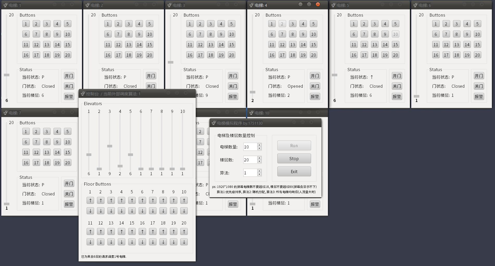
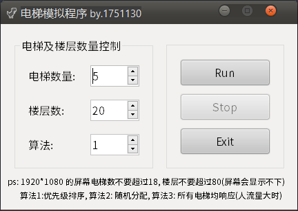
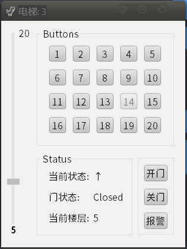
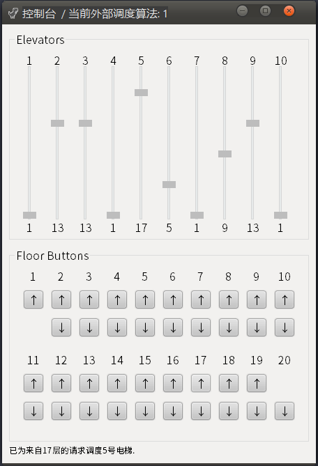
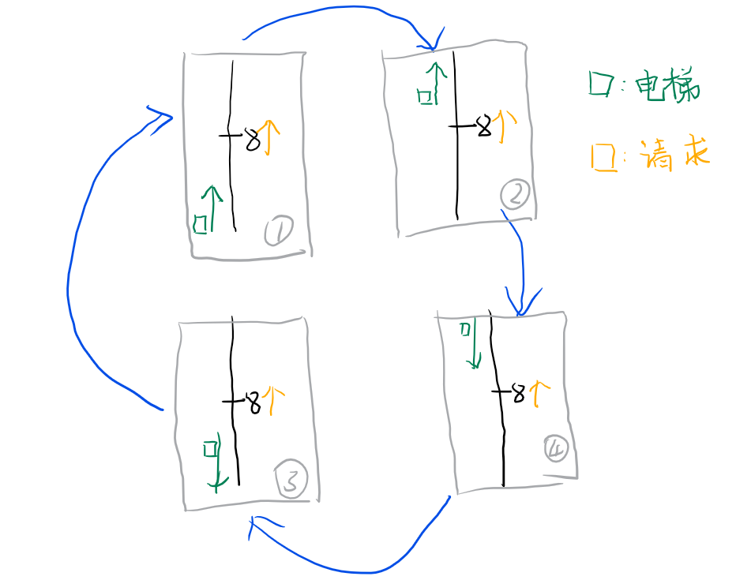

# 处理机管理-电梯调度
> 操作系统 课程作业 1 

    



## 项目背景及需求
某一层楼20层，有五部互联的电梯。基于线程思想，编写一个电梯调度程序。

每个电梯里面设置必要功能键：如数字键、关门键、开门键、上行键、下行键、报警键、当前电梯的楼层数、上升及下降状态等。

每层楼的每部电梯门口，应该有上行和下行按钮和当前电梯状态的数码显示器。

五部电梯门口的按钮是互联结的，即当一个电梯按钮按下去时，其他电梯的相应按钮也就同时点亮，表示也按下去了。

所有电梯初始状态都在第一层。每个电梯如果在它的上层或者下层没有相应请求情况下，则应该在原地保持不动。


## 开发/运行环境

环境: Windows 10 1903

语言: C++ / MinGW x64 8.1.0 / Qt 5.12.0


----

## 系统架构

项目文件:
```sh
    └─elevator
        │  README.md
        │
        ├─release
        │  │  elevator_sim.exe
        │  │  Qt5Core.dll
        │  │  Qt5Gui.dll
        │  │  Qt5Widgets.dll
        │  │
        │  ├─platforms
        │  │      qwindows.dll
        │  │
        │  └─styles
        │          qwindowsvistastyle.dll
        │
        └─src
            building.cpp
            building.h
            building.ui
            elevator.cpp
            elevator.h
            elevator.ui
            elevator_sim.pro
            elevator_sim.pro.user
            main.cpp
            mainwindow.cpp
            mainwindow.h
            mainwindow.ui
```

项目包含三个类: 主窗口类 `mainwindow`, 电梯类 `elevator`, 控制台类 `building`, 每个类均有自己的界面实现. 程序运行后, 实例化一个 `mainwindow` 类. 调整电梯与楼层的数量后, `mainwindow` 的 `run()` 方法实例化若干个 `elevator` 类和一个 `building` 类. 前者包括了电梯内部的楼层按钮与显示, 后者包括了电梯外部每一层楼的按钮以及每个电梯状态的显示.


### mainwindow 类
>程序主窗口, 继承自 `QMainWindow` 类



1. `Run`: 运行模拟
2. `Stop`: 停止模拟并销毁所有其他窗口
3. `Exit`, `X`: 销毁所有其他窗口之后退出
4. `算法选择框`: 选择外部分派算法, 共有三种算法, 在后文有详细叙述

```c++
void run();      // To start simiulations.
void my_stop(); // To stop simiulations.
```

### elevator 类
>电梯窗口, 继承自 `QWidget` 类
每 800ms 刷新一次状态




1. `Slider`: 用于指示电梯当前位置, 不可滑动. 上方标签为最大楼层, 下方标签为当前楼层.
2. `Buttons`: 模拟电梯内部选择楼层的按钮, 按钮为灰色代表此楼层已按下.
3. `当前状态`: 共有三种状态, 停止: `P`, 上升: `↑`, 下降: `↓`;
4. `门状态`: 共有四种, `"Closed`, `Opened`, `Closing`, `Opening"`
5. `开门`: 电梯正在运行时, 无法进行操作.

```c++
    void open_door();
    void renew_label();
    void check_when_run();
    void check_when_pause();
    void timer_elevator_tick(); // Run every ELEVATOR_TIMER_TICK ms.
    void cancel_request(int floor);
    // Recive task request form outside(building), and add it to destO. .
    // See "send_request()" in class "building".
    bool recive_request(bool up = true, int floor = 1, bool forceRecive = false);
```

### building 类
>外部控制窗口, 模拟电梯外部的操作, 继承自 `QWidget` 类
每 100ms 刷新一次状态



1. `Elevators`: 显示所有电梯当前的状态
2. `Floor Buttons`: 每一层楼的上行和下行按钮, 按钮为灰色代表此按钮已被按下.
3. `状态栏`: 显示调度操作

```c++
    void timer_building_tick(); // Run every 0.1s.
    void renew_label(unsigned int i);
    // Main func to select elevator(s) and send task request(s) after button clicked.
    void ele_select_send(bool up = true, int floor = 1);
    // Caculate every elevator's rating, for elevator selecting.
    // Only be used in the ELE_SELECT_MODE_1.
    int  ele_rate(bool reqUp, int reqFloor, int eleFloor, int eleStatus);
    // See "recive_request" in class "elevator".
    bool send_request(bool up = true, int floor = 1, elevator *ele = nullptr, bool forceRecive = false);
```


## 调度算法

### 内部调度算法
每一个电梯内部维护两个表: `<int> destsInside` 和 `<int> destsOutside`, 分别用来储存来自内部按钮的楼层请求和来自电梯外部按钮的请求.

#### destsInside
当电梯内部的按钮被按下后, 触发事件, 将按钮代表的楼层添加进数组 `<int> destsInside` 中. 

#### destsOutside
电梯不主动处理外部按钮的事件, 而是以被动的形式接收外部的请求. 对于每一个外部的按钮按下事件, 用一个组合 `[是否上行, 楼层]` 来记录此任务. 例如按下四楼上行按钮, 则产生任务 `[true, 4]`. `building` 类负责将此任务分配给特定的电梯(下一节叙述这部分).

电梯类拥有一个方法 `void recive_request()`, 这个方法接收三个参数 `bool up = true`, `int floor = 1`, `bool forceRecive = false`. 这个方法用于接受外界的任务请求, 前两个参数描述了该任务, 而第三个参数决定是否强制此方法接受任务.

`elevator` 收到任务后, 首先进行判断. 在不强制电梯接受任务 (`forceRecive == false`) 的前提下如果任务请求和电梯状态均为上行, 且电梯当前在该楼层之上或者任务请求和电梯状态均为下行, 且电梯当前在该楼层之下时, 电梯拒绝该请求, 并返回 `false`.

如果电梯接收任务, 会继续判断该任务是否已经在任务列表 `destsOutside` 中, 如果不在, 则向 `destsOutside` 中添加此任务. 添加完成后, 临时添加一次电梯的状态检查 (避免添加任务后等待轮询函数的状态检查带来的滞后).

#### timer_elevator_tick()
电梯类有 `void timer_elevator_tick();` 方法, 每 800ms 被触发器 `timer` 触发一次. 这个实现两个功能, 更新电梯状态, 修改 `currentFloor`. 之后根据电梯状态调用不同的检查函数 `check_when_run()` 或 `check_when_pause()`.

#### check_when_run() 和 check_when_pause()
这两个方法负责检查电梯状态. 首先合并 `destsInsider` 和 `destsOutsider` 得到 `dests`. 之后判断电梯当前是否已经到达目的地, 如是, 则从对应的列表中删掉该任务. 之后分别判断并更新状态:

1. 停止状态: 

|电梯当前位置|是否有任务在电梯当前位置之上|是否有任务在电梯当前位置之上|电梯行为|
|----|:-----:|:-----:|---|
|$总楼层\cfrac{1}{2}$以上|$\checkmark$|$\checkmark$|上升 ↑|
|$总楼层\cfrac{1}{2}$以上|$\checkmark$|$\times$|上升 ↑|
|$总楼层\cfrac{1}{2}$以上|$\times$|$\checkmark$|下降 ↓|
|$总楼层\cfrac{1}{2}$以上|$\times$|$\times$|不变 P|
|$总楼层\cfrac{1}{2}$以下|$\checkmark$|$\checkmark$|下降 ↓|
|$总楼层\cfrac{1}{2}$以下|$\checkmark$|$\times$|下降 ↓|
|$总楼层\cfrac{1}{2}$以下|$\times$|$\checkmark$|上升 ↑|
|$总楼层\cfrac{1}{2}$以下|$\times$|$\times$|不变 P|

2. 运行状态: 

|电梯当前状态|是否有任务在电梯当前位置之上|是否有任务在电梯当前位置之上|电梯行为|
|----|:-----:|:-----:|---|
|上升 ↑|$\checkmark$|$\checkmark$|不变 ↑|
|上升 ↑|$\checkmark$|$\times$|不变 ↑|
|上升 ↑|$\times$|$\checkmark$|下降 ↓|
|上升 ↑|$\times$|$\times$|停止 P|
|下降 ↓|$\checkmark$|$\checkmark$|不变 ↓|
|下降 ↓|$\checkmark$|$\times$|不变 ↓|
|下降 ↓|$\times$|$\checkmark$|上升 ↑|
|下降 ↓|$\times$|$\times$|停止 P|

#### cancel_request(int floor)
这个函数是 `dests` 分为两个的原因. 

这个函数可以供外部调用, 用于撤销任务请求.


### 内部调度实现
这部分代码见文件 [elevator.cpp](src/elevator.cpp) 81-173行.

### 外部调度算法
外部调度在类 `building` 中实现, 用于外部的任务的分配.

#### bool send_request()
这个方法用于实现与 `elevator::recive_request()` 的对接.

#### int ele_rate()
这个函数用于实现对电梯进行评分, 接受四个参数: `bool reqUp` (请求是否是上行), `int reqFloor` (请求的楼层), `int eleFloor` (电梯楼层), `int eleStatus` (电梯状态).
电梯的评分由两部分构成: `distanceRating` (60%) 和 `statusRating` (40%).

1. distanceRating

|电梯位置|distanRating|
|--|:--:|
|电梯与请求楼层相同|10000|
|电梯与请求楼层不同|$\cfrac{{\| eleFloor-reqFloor}\|}{FLOOR\_NUM}$|

2. statusRating

首先, 如果电梯停止中, 就将 `distanceRating` 乘以 3.

<table style="text-align:center;"><tr><td><b>电梯状态</b></td><td><b>请求类型</b></td><td><b>eleFloor ? reqFloor</b></td><td><b>statusRating</b></td></tr><tr><td >停止</td><td colspan="2">\</td><td><b>1.0</b></td></tr><tr><td rowspan="4">上升</td><td rowspan="2">上升</td><td><</td><td><b>1.0</b></td></tr><tr><td>></td><td><b>0.2</b></td></tr><tr><td rowspan="2">下降</td><td><</td><td><b>0.6</b></td></tr><tr><td>></td><td><b>0.4</b></td></tr><tr><td rowspan="4">下降</td><td rowspan="2">上升</td><td>></td><td><b>1.0</b></td></tr><tr><td><</td><td><b>0.2</b></td></tr><tr><td rowspan="2">下降</td><td>></td><td><b>0.6</b></td></tr><tr><td><</td><td><b>0.4</b></td></tr></table>

源码:
```c++
statusRating = eleStatus == 0 ? 1.0 : reqUp ? eleStatus == 1 ? eleFloor < reqFloor ? 1.0 : 0.2
                                                             : eleFloor < reqFloor ? 0.6 : 0.4
                                            : eleStatus == 2 ? eleFloor > reqFloor ? 1.0 : 0.2
                                                             : eleFloor > reqFloor ? 0.6 : 0.4;
```

假设有一个请求在8楼, 上行. 此时的电梯有四种运行状态和一种停止状态, 且这四种状态是轮换的: 



如果规定停止是状态 ⑤, 显然这五种状态的优劣: ⑤ = ① > ③ > ④ > ②. 据此得到上面的表格.

#### ele_select_send()

`building` 有三种任务分派算法:

1. 优先级调度
    1. 根据请求, 计算每个电梯的分数, 排序, 得到次序表.
    2. 向次序表的第一个电梯发送请求, 如果被拒绝, 则放弃此电梯, 并向下一个电梯发送请求.
    3. 重复步骤2, 直到请求被某个电梯接受, 退出算法.
    4. 如果请求被所有电梯拒绝, 则强制命令次序表的第一个电梯接受任务. 
    5. 退出算法.

2. 随机分派

3. 全部响应调度
    1. 将任务分配给所有电梯.
    2. 如果有电梯已经到达, 则向其他电梯取消请求.
    这种电梯适用于突发人流量大时. eg. 图书馆里的人大多聚集在9-11楼, 在闭馆时大量请求发生于9-11楼, 可以采用这种方式.


### 外部调度实现
见 [building.cpp](src/building.cpp) 83-135 行.

## 其他
1. 内部调度算法需要优化
1. 加入测试模式: 随机生成 1000 个人, 用于检测算法的性能.
